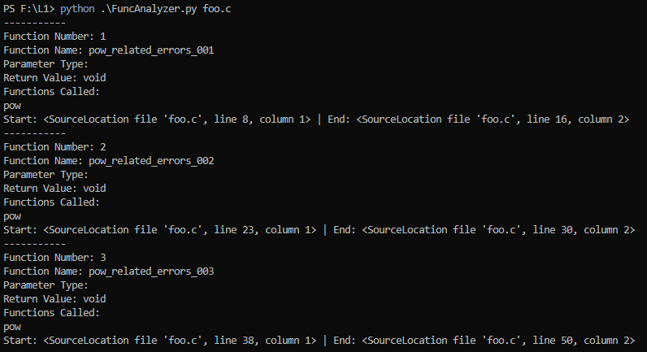
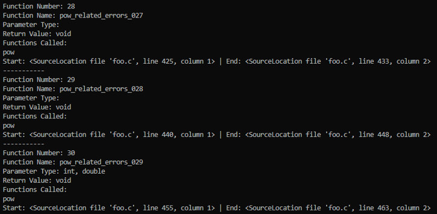
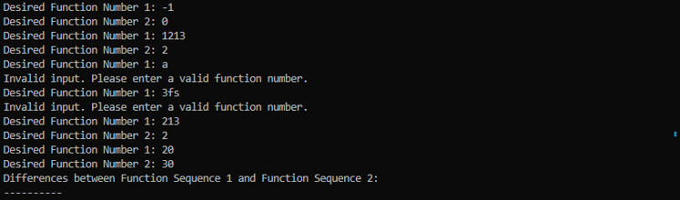
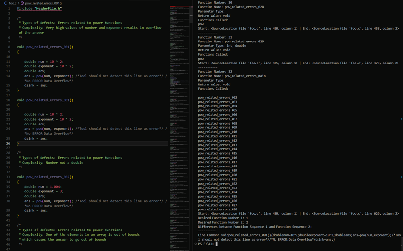

# C/Cpp Analyzer

This script uses Clang to analyze C/C++ source code and provides information about functions in the codebase. It includes functionality to extract function details, identify functions called within a function, output start and end lines for each function, and compare the differences between any two functions.

## Considerations

Initially, I struggled to find a possible solution. I considered using regex and spent a significant amount of time developing regex patterns, but found that the approach was quite intricate. So, I looked for better solutions on the internet and was introduced to the `libclang` module.

## Resources

- [Documentation](https://libclang.readthedocs.io/en/latest/)
- [Further Reference](https://eli.thegreenplace.net/2011/07/03/parsing-c-in-python-with-clang)
- [difflib](https://docs.python.org/3/library/difflib.html#difflib.Differ)

With these tools and my previous knowledge, I have developed code for the analysis of the source code that essentially addresses the following:

- ***Functionality 1:*** Identify the function name, parameter types, and returned value types for each function.
- ***Functionality 2:*** Determine which other functions each function has called.
- ***Functionality 3:*** Output the start and end lines for each function.
- ***Functionality 4:*** Output the differences between any two functions.

## Requirements

- `clang.cindex`
- `re`
- `sys`
- `difflib`

## How to Use

1. Ensure you have the required libraries installed.
2. Run the script from the command line with the target C/C++ source code file as a command-line argument.

```bash
python script.py target_file.c
```

## Functionality

Function Details Extraction (`extract_parameters_and_return`): Extracts function name, parameter types, and return type using regular expressions.
Function Calls Extraction (`print_called_functions`): Recursively prints functions called within a given function.
Function Body Extraction (`extract_function_body`): Extracts the source code of a function.
Function Comparison (`compare_functions`): Compares two function bodies using difflib and outputs the differences.
Main Analysis (`if name == "main"):
- Parses the target file using Clang and stores the translation unit.
- Iterates over functions in the translation unit, extracting and printing information.
- Provides the option to compare the differences between any two functions.

## Notes

- Ensure that the Clang library is properly installed and configured for the script to work correctly.
- This script serves as a tool for basic C/C++ code analysis and comparison of function implementations.
- Feel free to modify and adapt the code for your specific needs.

## Test Cases

- I have used a command-line argument to pass the C/C++ file that has been provided.
- It iterates over all the functions.
- It provides the function names.
- If there are no parameters, it does not provide anything.
- Return values are included in the output.
- It lists the functions called within each function.
- It provides the start and end lines.
- I changed the functions in the C/C++ file, giving them parameters of `int` and `double`, and checked whether this code can properly generate output.




- The program prompts the user for the desired function number, and it continues iterating until the user provides valid input.


- I modified the C/C++ file to include two similar functions, aiming to observe if the comparison output highlights common values.

